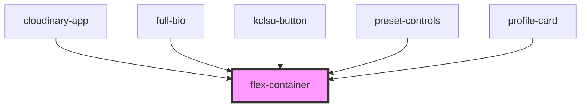

# flex-container

<!-- Auto Generated Below -->

## Properties

| Property        | Attribute        | Description | Type      | Default     |
| --------------- | ---------------- | ----------- | --------- | ----------- |
| `alignx`        | `alignx`         |             | `string`  | `undefined` |
| `aligny`        | `aligny`         |             | `string`  | `undefined` |
| `direction`     | `direction`      |             | `string`  | `undefined` |
| `fillContainer` | `fill-container` |             | `boolean` | `undefined` |
| `mobcolumn`     | `mobcolumn`      |             | `boolean` | `undefined` |
| `wrap`          | `wrap`           |             | `boolean` | `undefined` |

## Dependencies

### Used by

 - [cloudinary-app](../../cloudinary)
 - [full-bio](../../profiles/bio)
 - [kclsu-button](../../buttons/kclsu-button)
 - [preset-controls](../../cloudinary/preset-controls)
 - [profile-card](../../cards/profile-card)

### Graph

----------------------------------------------

*Built with [StencilJS](https://stenciljs.com/)*
