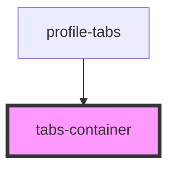

# tabs-container

<!-- Auto Generated Below -->

## Properties

| Property   | Attribute  | Description | Type      | Default |
| ---------- | ---------- | ----------- | --------- | ------- |
| `innertab` | `innertab` |             | `boolean` | `false` |

## Dependencies

### Used by

 - [profile-tabs](../../profiles)

### Graph

----------------------------------------------

*Built with [StencilJS](https://stenciljs.com/)*
