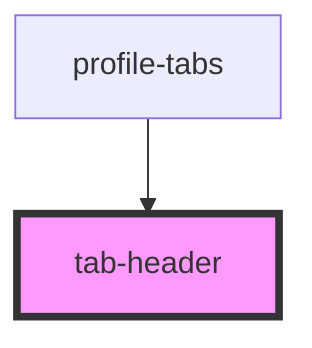

# tab-header

<!-- Auto Generated Below -->

## Properties

| Property | Attribute | Description | Type      | Default     |
| -------- | --------- | ----------- | --------- | ----------- |
| `active` | `active`  |             | `boolean` | `false`     |
| `name`   | `name`    |             | `string`  | `undefined` |

## Events

| Event       | Description | Type               |
| ----------- | ----------- | ------------------ |
| `selectTab` |             | `CustomEvent<any>` |

## Dependencies

### Used by

 - [profile-tabs](../../../profiles)

### Graph

----------------------------------------------

*Built with [StencilJS](https://stenciljs.com/)*
